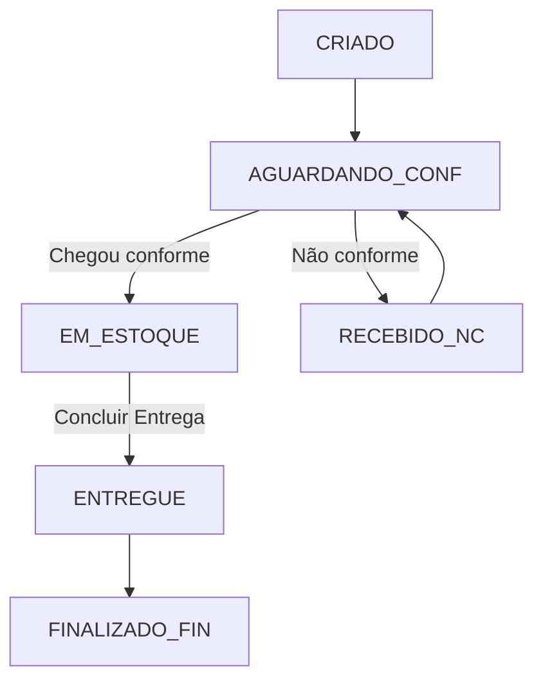

# Estoque Exonvais

Sistema de gerenciamento de estoque para produtos de enxovais com controle completo de pedidos, confecção, estoque e financeiro.

## 📋 Funcionalidades

- **Gestão de Clientes**: Cadastro e controle de status (adimplente/inadimplente)
- **Pedidos Comuns**: Produtos prontos com configurações padrão
- **Encomendas Sob Medida**: Produtos personalizados com medidas específicas
- **Fluxo de Status**:
  - Pedidos criados
  - Aguardando confecção
  - Pedidos em estoque
  - Não conformes (com registro de incidências)
- **Controle Financeiro**: Gestão de custos, vendas, margens e pagamentos
- **Relatórios**: Análise de pedidos e performance

## 🚀 Instalação

### Pré-requisitos

- Python 3.8 ou superior
- pip

### Passos

1. Clone ou baixe o repositório:
```bash
cd e:\dev\enxovais_app
```

2. Instale as dependências:
```bash
pip install -r requirements.txt
```

## �️ Configuração do Banco de Dados

O aplicativo suporta dois modos de banco de dados:

### Desenvolvimento Local (SQLite)
- **Padrão**: Usa SQLite automaticamente
- **Arquivo**: `exonvais.db` na raiz do projeto
- **Configuração**: Nenhuma necessária

### Produção (PostgreSQL)
Para usar PostgreSQL no Streamlit Cloud:

1. **Crie uma conta gratuita** no [Supabase](https://supabase.com) ou [Neon](https://neon.tech)

2. **Configure o banco**:
   - Crie um novo projeto
   - Anote a connection string (DATABASE_URL)

3. **No Streamlit Cloud**:
   - Vá para seu app > Settings > Secrets
   - Adicione: `DATABASE_URL = "postgresql://..."`

4. **Deploy**: O app detectará automaticamente e usará PostgreSQL

**Nota**: Dados locais (SQLite) não são migrados automaticamente. Use scripts de migração se necessário.

## �📦 Executar o aplicativo

```bash
streamlit run app.py
```

O aplicativo abrirá automaticamente no navegador em `http://localhost:8501`

## 📁 Estrutura do Projeto

```
estoque_exonvais/
├── app.py                              # Dashboard principal
├── pages/                              # Páginas do Streamlit
│   ├── 01_Clientes.py
│   ├── 02_Produtos_Comuns.py
│   ├── 03_Encomendas_Sob_Medida.py
│   ├── 04_Status__Pedidos.py
│   ├── 05_Status__Aguardando_Confeccao.py
│   ├── 06_Status__Pedidos_em_Estoque.py
│   ├── 07_Status__Nao_Conformes.py
│   ├── 08_Financeiro.py
│   └── 09_Relatorios.py
├── core/                               # Módulos principais
│   ├── db.py                          # Banco de dados SQLite
│   ├── models.py                      # Modelos de dados
│   ├── audit.py                       # Sistema de auditoria
│   ├── storage.py                     # Gerenciamento de arquivos
│   └── validators.py                  # Validações
├── services/                           # Serviços auxiliares
│   ├── exporter.py                    # Exportação de documentos
│   ├── messenger.py                   # Integração WhatsApp
│   ├── payments.py                    # Processamento de pagamentos
│   └── quality.py                     # Controle de qualidade
├── ui/                                 # Componentes de interface
│   ├── components.py                  # Componentes reutilizáveis
│   └── status_badges.py              # Badges de status
├── uploads/                            # Armazenamento de fotos
├── assets/                             # Recursos estáticos
├── requirements.txt                    # Dependências Python
└── README.md                          # Este arquivo
```

## 🔄 Fluxo de Pedidos



## 💾 Banco de Dados

O sistema utiliza SQLite com as seguintes tabelas principais:

- **clients**: Cadastro de clientes
- **orders**: Pedidos com todos os detalhes
- **shipments**: Registro de envios
- **nonconformities**: Não conformidades registradas
- **finance_entries**: Lançamentos financeiros
- **payment_batches**: Lotes de pagamento
- **audit_log**: Log de auditoria de todas as operações

## 🛠️ Tecnologias

- **Streamlit**: Framework web para Python
- **SQLite**: Banco de dados embutido
- **Pillow**: Processamento de imagens
- **Python-dateutil**: Manipulação de datas

## 📝 Uso

### 1. Cadastrar Cliente
Acesse "Clientes" no menu lateral e preencha o formulário com os dados do cliente.

### 2. Criar Pedido
- **Produtos Comuns**: Use para itens padrão (lençóis, toalhas, etc.)
- **Sob Medida**: Use para produtos personalizados com medidas específicas

### 3. Acompanhar Status
Navegue pelas páginas de status para:
- Enviar pedidos para fornecedores
- Registrar recebimento (conforme ou não conforme)
- Movimentar produtos para estoque
- Concluir entregas

### 4. Gerenciar Não Conformidades
Quando produtos chegarem fora do padrão:
- Registre o tipo de problema
- Adicione descrição detalhada
- Reenvie ao fornecedor

### 5. Controle Financeiro
- Visualize lançamentos pendentes
- Selecione pedidos para pagamento
- Crie lotes de pagamento para fornecedores

### 6. Relatórios
Acesse métricas e estatísticas do sistema.

## 🔮 Próximas Implementações

- [ ] Upload e gerenciamento de múltiplas fotos
- [ ] Exportação de pedidos em PDF
- [ ] Integração com WhatsApp
- [ ] Relatórios avançados com gráficos
- [ ] Sistema de notificações
- [ ] Backup automático

## 📄 Licença

Este projeto é de uso interno.

## 👥 Suporte

Para dúvidas ou problemas, entre em contato com a equipe de desenvolvimento.
